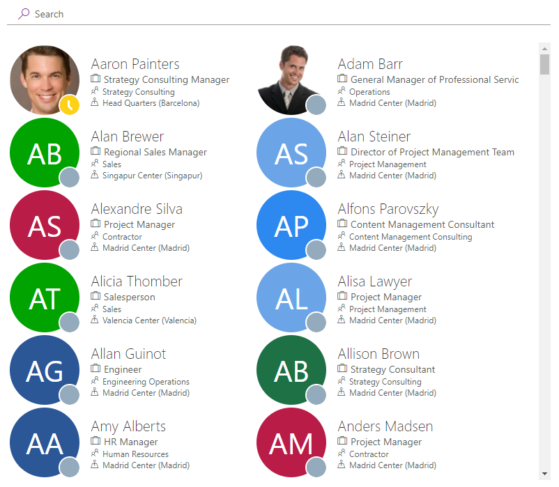
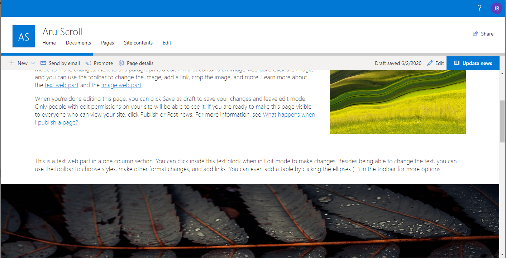

# SPFx Web Parts
---

This repository contains SPFx samples realized by @jbarbam.

## Additional resources

* [Overview of the SharePoint Framework](http://dev.office.com/sharepoint/docs/spfx/sharepoint-framework-overview)
* [SharePoint Framework development tools and libraries](http://dev.office.com/sharepoint/docs/spfx/tools-and-libraries)
* [SharePoint Framework Reference](http://aka.ms/spfx-reference)
* [Visual Studio Extension for SharePoint Framework projects](https://github.com/SharePoint/sp-dev-fx-vs-extension)

## Using the samples
To build and start using these projects, you'll need to clone and build the projects.
1. Clone this repository by executing the following command in your console:
  ```bash
  git clone https://github.com/jbarbam/SPFx.git
  ```
1. Navigate to the cloned repository folder:
  ```bash
  cd `repository-folder-name`
  ```
1. Access to sample webpart.
To access the samples use the following command, where you replace `sample-folder-name` with the name of the sample you want to access.
```bash
cd webparts
cd sample-folder-name
```

1. Install the packages
Now run the following command to install the npm packages:
```bash
npm install
```
This will install the required npm packages and dependencies to build and run the client-side project.

1. Run then webpart
Once the npm packages are installed, run the following command to preview your web parts in SharePoint Workbench:
```bash
gulp serve
```
## Disclaimer
**THIS CODE IS PROVIDED AS IS WITHOUT WARRANTY OF ANY KIND, EITHER EXPRESS OR IMPLIED, INCLUDING ANY IMPLIED WARRANTIES OF FITNESS FOR A PARTICULAR PURPOSE, MERCHANTABILITY, OR NON-INFRINGEMENT.**

## Author(s) & Contributor(s)

Repository|Author(s)
--------|---------
SPFx|Juan Barba (M365 & SharePoint software engineer), @jbarbam)


## Web parts included

Overview |  Web Part |  Description
------------ | ----------- | -----------
 | [**Who is Who**](https://github.com/jbarbam/SPFx/webparts/who-is-who) | With this web part, you can search users. This web part use MS Graph API to access users information and Fluent UI controls to show these user information.
 | [**Scroll Page Indicator**](https://github.com/jbarbam/SPFx/webparts/scroll-page-indicator) | This webpart represents scrollbar page indicator for SharePoint modern pages.The progress bar increases or decreases when user scrolling through the page.


> Sharing is caring!
