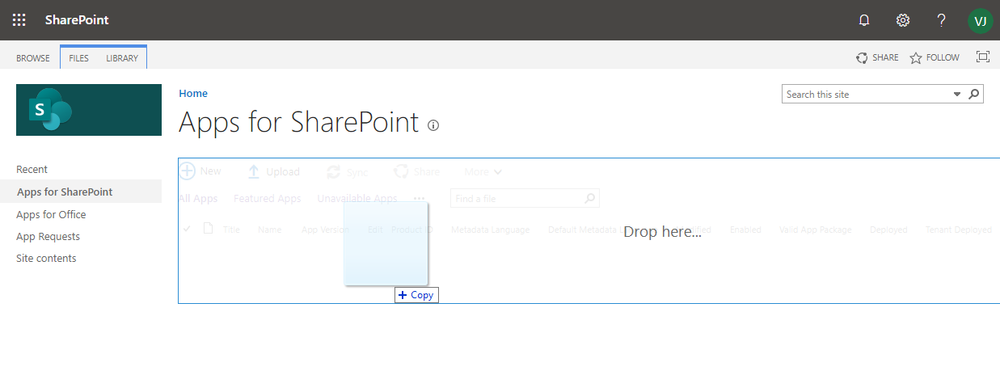

# SPFx webpart Who is Who. Search users in M365

## Summary


This sample represent a user M365 search webpart.
The current user can search users by the next M365 user properties:
- displayName
- givenName
- surname
- mail
- jobTitle
- city

Also user information, the webpart shows user photo when it is informed and presence state.
This webpart uses MS Graph API to make the search and Fluent UI controls to representing user information retrieve by MS Graph API calls.

For each user in results, his presence is checked every 10 seconds.

## Used SharePoint Framework Version


## Applies to

* [SharePoint Framework Developer](http://dev.office.com/sharepoint/docs/spfx/sharepoint-framework-overview)
* [Office 365 developer tenant](http://dev.office.com/sharepoint/docs/spfx/set-up-your-developer-tenant)
* [Microsoft Graph](https://developer.microsoft.com/en-us/graph)
* [Fluent UI](https://developer.microsoft.com/en-us/fluentui#)

## Solution

Solution|Author(s)
--------|---------
who-is-who|Juan Barba (M365 & SharePoint software engineer), @jbarbam)

## Version history

Version|Date|Comments
-------|----|--------
1.0.0|May 22, 2020|Initial release

## Disclaimer

**THIS CODE IS PROVIDED *AS IS* WITHOUT WARRANTY OF ANY KIND, EITHER EXPRESS OR IMPLIED, INCLUDING ANY IMPLIED WARRANTIES OF FITNESS FOR A PARTICULAR PURPOSE, MERCHANTABILITY, OR NON-INFRINGEMENT.**

## Building the code

1. Clone the report in your local machine.
```bash
git clone the repo
```
1. Install the dependencies.
```shell
npm install
```
1. Bundle the solution in release mode.
```shell
gulp bundle --ship
```
1. Package the solution.
```shell
gulp package-solution --ship
```
Next, You need to deploy the package that was generated to tenant or sitecollection App Catalog.
> **NOTE**
> If you don't have an app catalog, a SharePoint Online Admin can create one by following the instructions in this guide: [Use the App Catalog to make custom business apps available for your SharePoint Online environment](https://support.office.com/article/use-the-app-catalog-to-make-custom-business-apps-available-for-your-sharepoint-online-environment-0b6ab336-8b83-423f-a06b-bcc52861cba0).

## Deploying the package

1. Go to your tenant's or sitecollection SharePoint App Catalog.

1. Upload or drag and drop the **who-is-who.sppkg** to the App Catalog

    

    This deploys the client-side solution package. Because this is a full trust client-side solution, SharePoint displays a dialog and asks you to trust the client-side solution to deploy.

    Notice how the **domain** list in the prompt says *SharePoint Online*. This is because the content is either served from the Office 365 CDN or from the App Catalog, depending on the tenant settings.

    Ensure that the **Make this solution available to all sites in the organization** option is selected, so that the web part can be used easily across the tenant.

    Notice the request to go to *API Management Page to approved pending permissions* and the list of required permissions, in this case being `User.Read.All, Presence.Read.All` for Microsoft Graph.

    

1. Select **Deploy**.

  Notice that you can see if there's any exceptions or issues in the package by looking the **App Package Error Message** column in the App Catalog.

  Now the web part is deployed and is automatically available cross the SharePoint Online sites, it's however important to realize that the web part *won't* work properly until the requested permissions have been approved.

## Approving requested Graph API permissions

1. Move to the SharePoint tenant administrative UIs located at `https://<tenant>-admin.sharepoint.com`

1. Move to **API management** under the **Advance** left menu option to see the currently pending permission requests. Notice that the request for `User.Read.All, Presence.Read.All` permissions for in Graph API is pending for approval

    

1. Select the pending permissions row and choose **Approve or reject** from the toolbar

    

1. Review the requested permissions in the left panel and choose **Approve**

    

  > **IMPORTANT**
  > Account used for granting the requested permissions will need to be a tenant administrator. SharePoint administrator permission is not sufficient as the operation is actually performed towards Azure Active Directory.

## Using web part in SharePoint

1. Go to a site where you want to test the web part. We did deploy web part using the tenant scoped deployment option, so it will be available on any site.
1. Create a new modern page to the site or edit existing page
1. Use search term `Who` in the web part picker to find your web part

    

1. Choose **WhoIsWho** from the list and notice how the web part renders the latest five emails from the current user using information from the Microsoft Graph API

   

## Features

This sample illustrates the following concepts on top of the SharePoint Framework:

* Using GraphHttpClient to get data from MS Graph API
* How to get Presence information using MS Graph API
* Using async / await for the async calls
* Fluent UI fabric components
