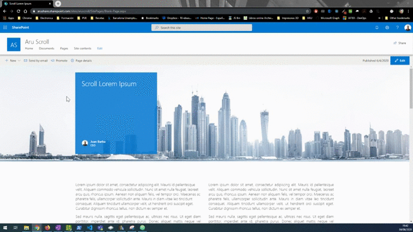
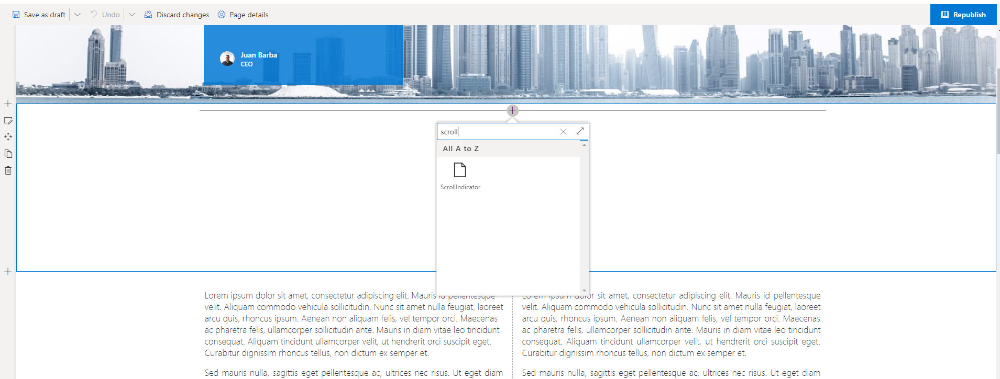
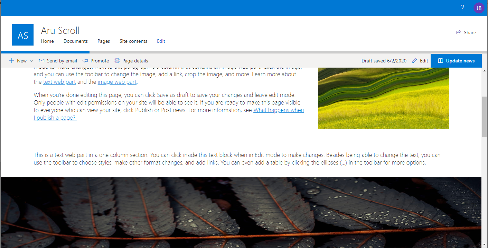

# SPFx webpart Scroll Page Indicator

## Summary

  This sample represents scrollbar page indicator for SharePoint modern pages.
  The progress bar increases or decreases when user scrolling through the page.

  

## Used SharePoint Framework Version

  

## Applies to

* [SharePoint Framework Developer](http://dev.office.com/sharepoint/docs/spfx/sharepoint-framework-overview)
* [Office 365 developer tenant](http://dev.office.com/sharepoint/docs/spfx/set-up-your-developer-tenant)

## Solution

Solution|Author(s)
--------|---------
scroll-page-indicator|Juan Barba (M365 & SharePoint software engineer), @jbarbam)

## Version history

Version|Date|Comments
-------|----|--------
1.0.0|June 04, 2020|Initial release

## Disclaimer

**THIS CODE IS PROVIDED *AS IS* WITHOUT WARRANTY OF ANY KIND, EITHER EXPRESS OR IMPLIED, INCLUDING ANY IMPLIED WARRANTIES OF FITNESS FOR A PARTICULAR PURPOSE, MERCHANTABILITY, OR NON-INFRINGEMENT.**

## Building the code

1. Clone the report in your local machine.
    ```bash
    git clone the repo
    ```
1. Install the dependencies.
    ```bash
    npm install
    ```
1. Bundle the solution in release mode.
    ```bash
    gulp bundle --ship
    ```
1. Package the solution.
    ```bash
    gulp package-solution --ship
    ```
Next, You need to deploy the package that was generated to tenant or sitecollection App Catalog.
> **NOTE**
> If you don't have an app catalog, a SharePoint Online Admin can create one by following the instructions in this guide: [Use the App Catalog to make custom business apps available for your SharePoint Online environment](https://support.office.com/article/use-the-app-catalog-to-make-custom-business-apps-available-for-your-sharepoint-online-environment-0b6ab336-8b83-423f-a06b-bcc52861cba0).

## Deploying the package

1. Go to your tenant's or sitecollection SharePoint App Catalog.

1. Upload or drag and drop the **scroll-page-indicator.sppkg** to the App Catalog

    

    This deploys the client-side solution package. Because this is a full trust client-side solution, SharePoint displays a dialog and asks you to trust the client-side solution to deploy.

    Notice how the **domain** list in the prompt says *SharePoint Online*. This is because the content is either served from the Office 365 CDN or from the App Catalog, depending on the tenant settings.

    Ensure that the **Make this solution available to all sites in the organization** option is selected, so that the web part can be used easily across the tenant.

1. Select **Deploy**.

  Notice that you can see if there's any exceptions or issues in the package by looking the **App Package Error Message** column in the App Catalog.

  Now the web part is deployed and is automatically available cross the SharePoint Online sites, it's however important to realize that the web part *won't* work properly until the requested permissions have been approved.

## Using web part in SharePoint

1. Go to a site where you want to test the web part. We did deploy web part using the tenant scoped deployment option, so it will be available on any site.
1. Create a new modern page to the site or edit existing modern page.
1. Use search term `Scroll` in the web part picker to find your web part.

    

1. Choose **ScrollIndicator** from the list.

   

1. **Save** and **Publish** the page. Notice how the web part renders a progress bar that changes when scrolling the page.

## Features

This sample illustrates the following concepts on top of the SharePoint Framework:

* SPFx React components.
